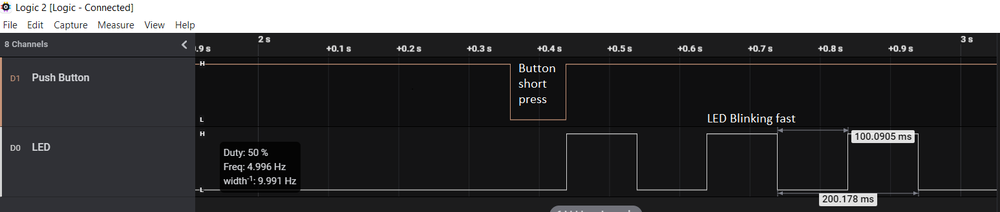

# Getting Started with GPIO using the AVR64DD32 with MCC Melody

 The repository contains four MPLAB® X projects:

- [1. Blink LED](#1-blink-led) This project shows how to toggle a pin connected to an LED.
- [2. Long and Short Button Press](#2-long-and-short-button-press) This project uses a pin as input to distinguish between a long and short button press, defined by a delay threshold.
 - [3. Wake-up on Button Press](#3-wake-up-on-button-press) This project sets the microcontroller to exit Sleep on button press, turn on an LED and go back to Sleep. On button release, the microcontroller exits Sleep, turns off the LED and goes back to Sleep.

## Related Documentation

More details and code examples on the AVR64DD32 can be found at the following links:

- [AVR64DD32 Product Page](https://www.microchip.com/wwwproducts/en/AVR64DD32)
- [AVR64DD32 Code Examples on GitHub](https://github.com/microchip-pic-avr-examples?q=AVR64DD32)
- [AVR64DD32 Project Examples in START](https://start.atmel.com/#examples/AVR64DD32CuriosityNano)

## Software Used

- [MPLAB® X IDE](http://www.microchip.com/mplab/mplab-x-ide) v6.00 or newer
- [MPLAB® XC8](http://www.microchip.com/mplab/compilers) v2.36 or newer
- [AVR-Dx Series Device Pack](https://packs.download.microchip.com/) v2.1.152 or newer
- [MPLAB® Code Configurator Melody](https://www.microchip.com/en-us/tools-resources/configure/mplab-code-configurator/melody) v2.1.9 or newer
- AVR Devices Library v4.4.0 or newer
- Content Manager v2.3.6 or newer

## Hardware Used

- The AVR64DD32 Curiosity Nano Development Board is used as test platform.
   
- Logic Analyzer

## Operation

To program the Curiosity Nano board with this MPLAB® X project, follow the steps provided in the [How to program Curiosity Nano Board](#how-to-program-curiosity-nano-board) chapter.  

## 1. Blink LED

This project shows how to blink the on-board LED on the Curiosity Nano Development Board. The LED is connected to a GPIO pin and it spends 500 ms in ON state and 500 ms in OFF state.

### 1.1 Setup 

The following configurations must be made for this project:

- CPU clock frequency is 4 MHz

| Pin | Configuration  |
| :-: | :------------: |
| PF5 | Digital Output |

### 1.2 Demo

The image below shows the waveform of the pin connected to the LED. The pin spends 500 ms in a high state and 500 ms in a low state.

 

### 1.3 Summary

This project shows how to blink an LED connected to a GPIO pin of the microcontroller.
  
[Back to top](#getting-started-with-gpio-using-the-avr64dd32-with-mcc-melody) 

## 2. Long and Short Button Press

This project uses the on-board push button of the Curiosity Nano Development Board as an input and detects short and long presses (defined by a delay threshold). The board's LED blink rate is low if a long press is detected and high if a short press is detected.

### 2.1 Setup 

The following configurations must be made for this project:

- CPU clock frequency is 4 MHz
- Pin PF6 has internal pull-up enabled

| Pin | Configuration  |
| :-: | :------------: |
| PF5 | Digital Output |
| PF6 | Digital Input|

### 2.2 Demo

The image below shows a short button press followed by the LED blinking at a high rate.

 

The image below shows a long button press followed by the LED blinking at a low rate.

 

### 2.3 Summary

The GPIO interface can be used to sense external digital signals to make certain decisions. In this code example, the focus was on pushing a button. An LED’s blink rate was slow if a long press was detected and fast if a short press was detected.
  
[Back to top](#getting-started-with-gpio-using-the-avr64dd32-with-mcc-melody) 

## 3. Wake Up on Button Press

This use case demonstrates how to wake up the microcontroller from Sleep mode by pressing a button. The microcontroller exits Sleep on button press, turns on the on-board LED and goes back to Sleep. On button release, the microcontroller exits Sleep mode, turns off the LED and goes back to Sleep.

### 3.1 Setup 

The following configurations must be made for this project:

- CPU clock frequency is 4 MHz
- Power-Down sleep mode set
- Global interrupts enabled
- Interrupt enabled for PF6 (push-button)
- Pin PF6 configured with internal pull-up

| Pin | Configuration  |
| :-: | :------------: |
| PF5 | Digital Output |
| PF6 | Digital Input|

### 3.2 Demo

The image below shows the behavior of the on-board LED when the push button is pressed.  After the button being pressed, the microcontroller exits Sleep mode and turn on the on-board LED.

 

### 3.3 Summary

This use case demonstrates how to wake up the microcontroller from Sleep mode by pressing a push button.
  
[Back to top](#getting-started-with-gpio-using-the-avr64dd32-with-mcc-melody) 

#

##  How to program Curiosity Nano Board

This chapter demonstrates how to use the MPLAB® X IDE to program an AVR® device with an Example_Project.X. This can be applied for any other projects.

1.  Connect the board to the PC.

2.  Open the Example_Project.X project in MPLAB X IDE.

3.  Set the Example_Project.X project as main project.
     Right click on the project in the **Projects** tab and click **Set as Main Project**.
     

4.  Clean and build the Example_Project.X project.
     Right click on the **Example_Project.X** project and select **Clean and Build**.
     

5.  Select the **AVRxxxxx Curiosity Nano** in the Connected Hardware Tool section of the project settings:
     Right click on the project and click **Properties**
     Click on the arrow under the Connected Hardware Tool
     Select the **AVRxxxxx Curiosity Nano** (click on the **SN**), click **Apply** and then click **OK**:
     

6.  Program the project to the board.
     Right click on the project and click **Make and Program Device**.
     

 

- [Back to 1. Blink LED](#1-blink-led) 
- [Back to 2. Long and Short Button Press](#2-long-and-short-button-press) 
- [Back to 3. Wake-up on Button Press](#3-wake-up-on-button-press)
- [Back to top](#getting-started-with-gpio-using-the-avr64dd32-with-mcc-melody)
